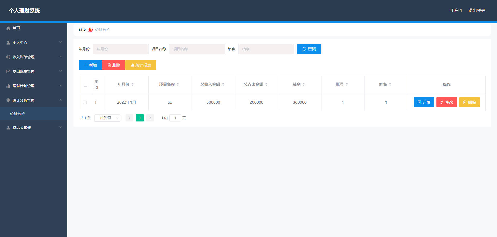

# 基于Springboot的个人理财系统

## Springboot-0083


## 技术栈

Springboot mybatisplus vue mysql maven


## 数据库表(10张)


## 功能介绍

```properties
个人理财系统管理员功能有个人中心，用户管理，账单类型管理。

用户功能有个人中心，收入账单管理，支出账单管理，理财计划管理，统计分析管理，备忘录管理等
```


## 图片

### 前台

### 后台





## 访问路径

### 前台

```properties
http://localhost:8080/springbootm47gb/front/pages/login/login.html

账号 1
密码 1
```

### 后台

```properties
http://localhost:8080/springbootm47gb/admin/dist/index.html#/login

账号 abo
密码 abo
```


## 功能图


## 文档目录


## 打赏或交流


